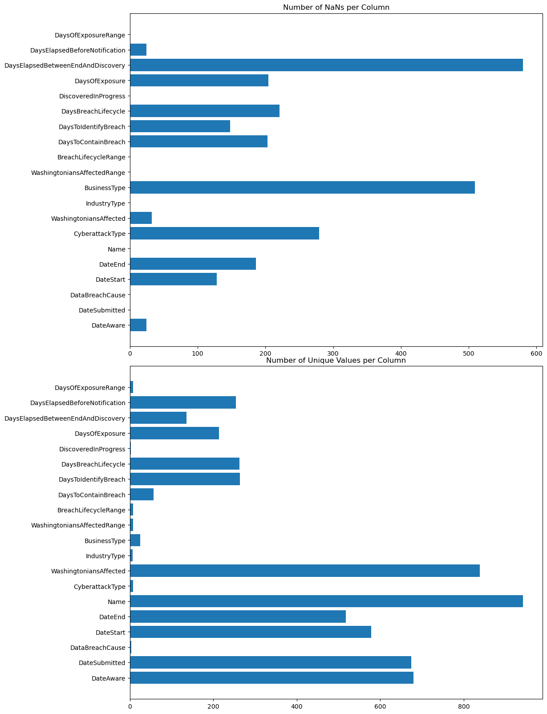

# Washington State Databreach Assessment

  

## Introduction

This project is an exploration into data breaches on organizations in Washington State, which those organizations are legally responsible for reporting to the state if the breach affects Washington residents in excess of 500 people. The organizations may optionally report if the number of affected residents falls below that range. That goes to say that not all of the organizations listed are based in Washington State and is important to keep in mind moving ahead in looking at the data.

### Purpose
The purpose of this project is to ask questions about the data and leverage those questions to draw useful statistical conclusions. The purpose is not to make conclusions on what to do with the information, or how it should be handled, though I will, with some hesitation, point out some inferences which could help strenghten the database in the future and allow for more definite conclusions to be drawn. This could assist State actors and agencies in making corrections and taking action, and may also serve as an example for others who would collect or analyze data.

### Database: Initial Exploratory Data Analysis
The Data Breach Notifications Affecting Washington Residents database contains 945 rows, and 24 columns, four of those columns, including: 'Id', 'YearText', 'Year', and 'EndedOnDayDiscovered' have been dropped. The first three of those 4 were already represented in functionality by other columns, while the 'EndedOnDayDiscovered' column did not provide information as expected because the contained True or False values didn't logically account for the differences between when an attack ended before being discovered, or ended after being discovered, and in no way indicates whether an organization had any influence in stopping the attack.

The CyberattackType column has been modified where any DataBreachCause entry states "Cyberattack" and CyberattackType states "NaN" to be better represented by "Unreported", as it cannot fall into an existing category since the definitions of those categories are not made explicit by the author. I have done this to make that data usable and be able to fully represent statistics involving Cyber Attacks.

Here are some basic statistics about the database:

  

There are numerous categorical columns which make the data highly organizable and readable, which accounts for the missing values in some columns, as not every event will fit into every category. However, many of the missing values are due to input on part of the organizations responsible for submitting their reports. I was still able to draw a reasonable interpretation from the data.
### Minimum Viable Product

At a minimum I will provide the organization, display, and description of most pertinent collections of information contained in the database, as well as provide access to my tools and methods for doing so.

## Conclusive information

Below is the results of my exploration and analysis in graphical form, along with descriptions. The charts can be located as image files in the image directory, the method of collection is located in the src directory. All of the steps, and testing for which is layed out in the notebooks directory.

### Statistical Discoveries

  

The above image illustrates, from the database, the percentages relative to the number of each type of data breach cause. Cyberattacks is the main cause, which is good in a way, because physical security, by law, should be high enough to protect against unauthorized access or theft, and mistakes should be prevented by training and policy.

Let's take a deeper look into Cyberattacks, what types there are, and how common each of them are:

  

As you can see there is an Unreported section, near 9% of the total events, these are attacks which when reported the type was not selected by the reporter, so I have taken the liberty of grouping them, where they would not fit in anywhere else. To continue, it is good news that Phishing is relatively low on the chart, considering that most organizations do, or should, have training to prevent Phishing scams that are usually preventable. Ransomware seems to be the approach of choice for attackers, with Malware not being too far behind.

  

The most affected industry is business, and though I think with common sense the reason is easy to surmise I will not speculate here. The fact remains that almost 50% of breaches are in the business industry. While the breaches distributed across other industries are relatively low in comparison. Let's take a look at what types of businesses are affected.

  

The above chart excludes several categories below software, which were breached 20 or less times total. Retail is at the top, which I feel again may have an obvious cause. Other is a close second category. Here I will suggest that perhaps there is a better way to handle categorization or input, and should indeed require some investigation because a category that vulnerable should be able to be identified, described, and managed.

### Patterns

Here we will identify several patterns in the data that may indicate what is happening when these breaches occur, or may require further investigation in order to take action or draw helpful conclusions.

  

We can see here that most of the time an attack was not discovered in progress. In this case I would suggest adding a column to collect additional information to explore why that may be, such as whether or not the organization was using an intrusion detection/intrusion protection device. For now, I do see this as a significant piece of information, that with some further investigation could provide some fruitful information.

  

This image indicates what range the number of Washingtonians affected fall into for each data breach. Most breaches seemed to affect between 1,000 and 9,999 people, with 500-999 being a close second. This may speak to the ease with which a breach may be carried out by an attacker, the size of the database owned by the organization being targeted could be and indicator of security level for the attacker, these are not suggestions for conclusions but mere ideas with which to begin an investigation into finding a definite conclusion. It would be very useful to know if the organization was utilizing a honeypot or not to secure their network.

  

This scatterplot plots each unique date against the number of breaches that occurred on that date. The indicators on the bottom axis are seperated biannually and serve as a general organizational structure. By looking at the clusters of data we can see that on most given dates only one breach occured, however in the latter years recorded it could occasionally be as many as 2, and even less, 3. The outliers here are large comparitively and it may be tempting to conclude that those were coordinated attacks, especially if the manner in which each breach occurred were the same. With some more investigation this could be determined definitively. There is one outlier not included in this data which I will explore further below.

### Outliers and Major Discoveries
Below is a small collection of information and charts which, according to the title, were outliers or discoveries I found either very interesting or very important.
#### Feb 07 2020
On 2022-02-07 there were 108 breaches conducted on a variety of organizations in the same manner(seen below).

  

  

Interestingly enough the largest portion of those affected were Non-Profit/Charity, which does not seem to follow the overall pattern of breaches recorded in the database. There is plenty of inferential/circumstantial evidence to suggest that this was a coordinated attack but that statement cannot be made without further investigation, I could find very little to no articles on the event and none of them directly related to Washington State. Education makes a close second category here.

  

This scatterplot allows us to see, for each individual organization breached on the given date, how many Washingtonians were affected. We can tell here that most of these organizations had a breach affecting less than 50,000 people. The single greates outlier makes up 1/3 of the total number affected.

The Feb 07 2022 breaches, together(3460534) were greater than the single greatest breach that occured(3243664) by 216870 people!

#### Top Ten

Below is a small table, containing information on the top 10 largest data breaches recorded.

  

Interestingly enough, the marginally small causes of data breaches as we've seen above, have ended up amongst the top 10 largest data breaches, and goes to show that every single breach should be handled with attention.

## Closing

In closing, I have been able to glean very useful information from the database and compile them into suitable charts and graphs. Despite this success, there are a number of aforementioned categories of information that, if added, would provide an even more whole and useful collection of information related to data breaches in Washington State. As such I have tried not to draw definitive conclusions but to only make suggestions and provide a certain amount of direction to the imagination that might assist in exploring the matter further and may help others to take affirmative action against data breaches using this information. Thank you for your time and attention.
